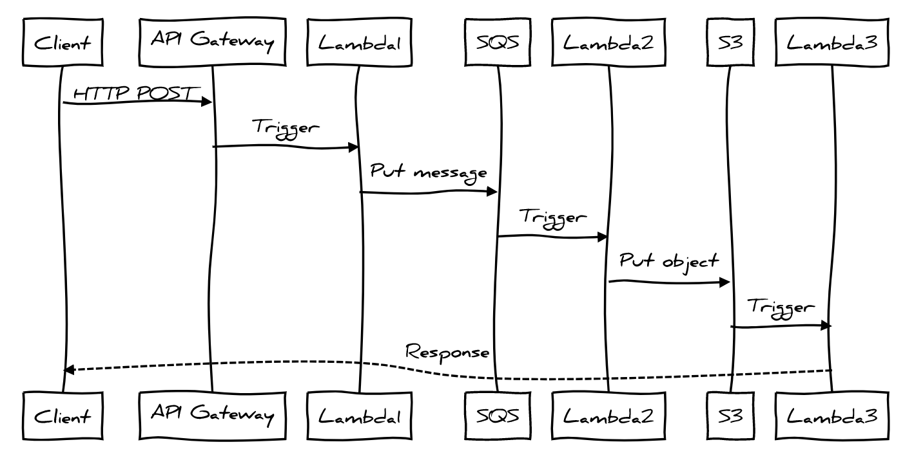

# ⚡ Serverless AWS Python Application

[](http://www.serverless.com)

This repository contains a serverless application that demonstrates an AWS Lambda-based system. The application uses AWS Lambda, Amazon S3, Amazon SQS, Amazon API Gateway, and Amazon CloudWatch Logs.

## Overview

The application consists of three AWS Lambda functions:

1. `lambda1` is triggered by an API Gateway endpoint. It logs the request and puts the request body on an SQS queue.
2. `lambda2` is triggered by the SQS queue. It logs the SQS event and puts the event into an object in the S3 bucket.
3. `lambda3` is triggered by S3 events. It logs the bucket and key of the created object.



## Prerequisites

- Node.js and npm installed (npm is distributed with Node.js - which means that when you download Node.js, you automatically get npm installed on your computer)
- Serverless Framework installed (`npm install -g serverless`)
- AWS account
- AWS CLI installed and configured

## Deployment

1. Clone this repository to your local machine.
2. Navigate to the project directory.
3. Install the required Serverless plugins (`npm install`).
4. (Optional) Install the Serverless Python Requirements plugin (`npm install --save-dev serverless-python-requirements`).
5. Modify the values of environment variables and tags in the provider section of the [serverless.yml](serverless.yml) file according to your preferences.
6. Configure your credentials as outlined in this [guide](https://www.serverless.com/framework/docs/providers/aws/guide/credentials). For the purpose of this demonstration, we'll be setting up the credentials directly on the machine that will deploy the application. You can do this by running the following command in your terminal:
    ```sh
    sls config credentials --provider aws --key YOUR_ACCESS_KEY --secret YOUR_SECRET_KEY
    ```
7. Deploy the application by running `sls deploy`.

After the deployment, the output should include the API Gateway endpoint which you can use to trigger the `lambda1` function with a `{"key":"value"}` POST request.
```sh
curl -X POST https://<api-id>.execute-api.<region>.amazonaws.com/dev/trigger -d '{"key":"value"}'
```

If the request is successful, you should see a response from your Lambda function on your terminal.

## Cleanup

To delete the deployed resources, run `sls remove`.

